# Glyphwalk

**Walk, ride and fly through an endless city drawn entirely in text characters.**

[](https://bsoulier.github.io/glyphwalk/)

Runs in the browser on desktop and phone. No install, no sign-up, and after the first visit it works offline.

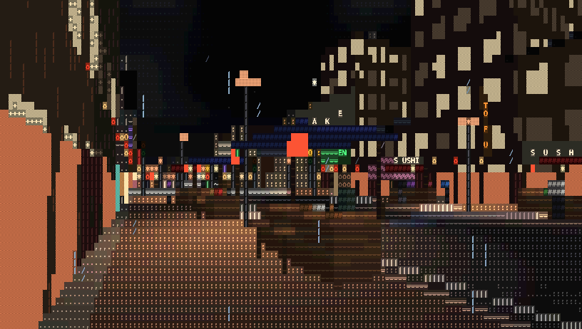

Every frame is a grid of characters. A software rasterizer draws the city at glyph resolution, choosing a character, a
foreground and a background colour for each cell, and the GPU turns the grid into pixels. There are no textures,
models, fonts or sound files: the city, its lighting and its soundtrack are all generated as you move through it, in
about 90 kB of gzipped JavaScript.

## Things to do

- **Explore nine districts**, each with its own architecture, street life and sound: Downtown towers, Japantown
  shophouses and pagodas, the gabled lanes of Old Town, Parisian boulevards in Le Marais, the Docklands, the family
  houses, lawns and picket fences of Maple Heights, the hedged mansions and pools of Silver Hills, the pastel Art Deco
  hotels and beach of the Seafront, and the domes, minarets and souks of the Medina.
- **Walk out of town.** The city stops about 1.5 km out from the tower, and farmland runs on from there: corn,
  soybeans, wheat rippling in the wind, pasture and hay with cattle grazing, country roads round every section, utility
  poles, windbreaks and lone oaks. Every few hundred metres a farmstead stands by the road: a white farmhouse you can
  walk into, a red barn, and either a dairy's silos and paddock or a grain farm's bins and machine shed. At night the
  fields go dark, the farms' yard lights come on, and the city glows on the horizon.
- **Ride up the Glyph Tower**, a 480 m landmark downtown: walk into the lobby, take the express lift, and look out over
  the whole city from the glass observation deck, then one more stop up to the open roof, with nothing overhead but
  the sky and the spire. It stays on the skyline wherever you are, so you can steer by it, or press `K` (or pick it in
  the District list) to go straight there.
- **Find the 81 hidden cats**, nine per district: in shops, on sidewalks and up on the roofs. Listen for meows; their
  eyes glow at night. Progress is saved.
- **Go inside**: shops, cafes, noodle bars, arcades, offices, family homes, mansions and riads, with furniture and
  people. Towers, hotels and offices have a lift; houses, farmhouses, mansions, riads, inns and ryokans have stairs
  you walk up.
  Front doors swing open as you come up to them; towers and modern shops keep sliding glass, and ryokans slide aside.
- **Hail a taxi** with `Enter` and ride in the back: the driver, the dashboard, the fare meter and the radio around you,
  and the city going by the windows as you turn your head. `Enter` again pays and drops you on the sidewalk.
- **Take the monorail**: loop lines circle every few districts with twelve stations each. Climb the stairs to a
  covered platform (benches, people waiting, and a MIND THE GAP sign), board with `Enter` when a train pulls in, and
  ride up front among the other passengers; `Enter` again gets you off at the next stop. Trains keep one timetable
  on the real clock, so everyone playing online sees the same ones.
- **Ride along** in a sky taxi, flick through street cameras, or just fly.
- **Stay up late**: the clock runs from dusk to dawn, windows light up, street markets open on each district's main
  street, and every five minutes there are fireworks over the docks.
- **Change the weather**: rain with thunder, snow that settles on the roofs, or fog.
- **Tune the taxi radio** to one of four stations composed on the fly: lo-fi, synthwave, jazz and ambient.
- **Take pictures**: photo mode freezes the city and saves a PNG, records a looping GIF, or copies the frame as plain
  text you can paste anywhere.
- **Share the exact view**: one key copies a link that opens the game at the same spot, hour and weather.
- **Put it on your phone**: touch controls, tilt-to-look, and "Add to Home Screen" for full-screen offline play.

| | |
|---|---|
| 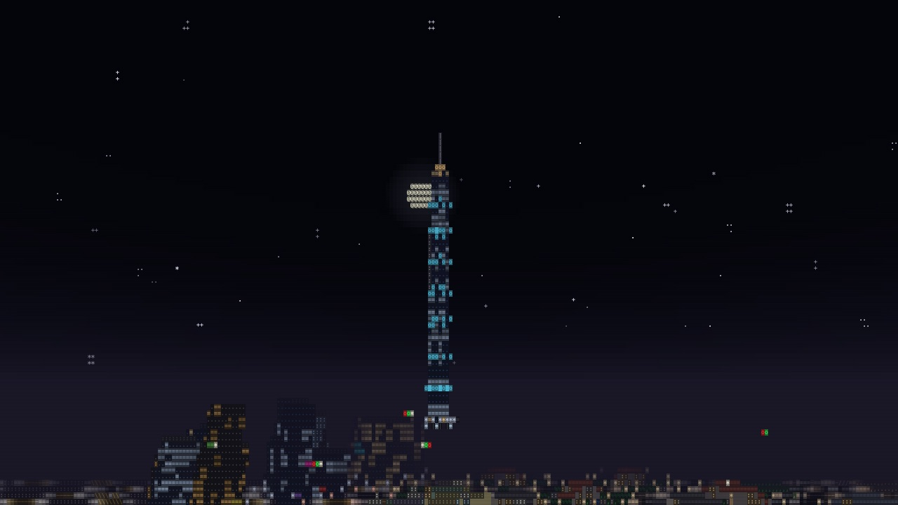 | 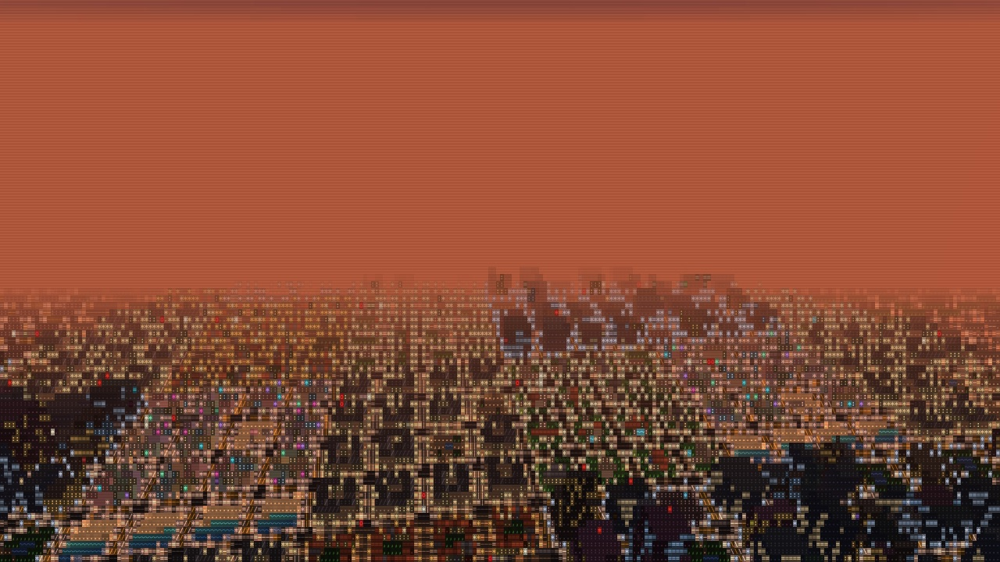 |
| 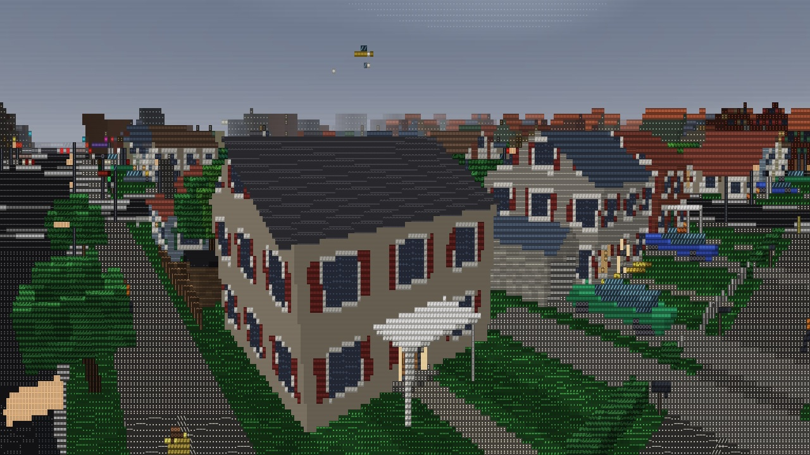 | 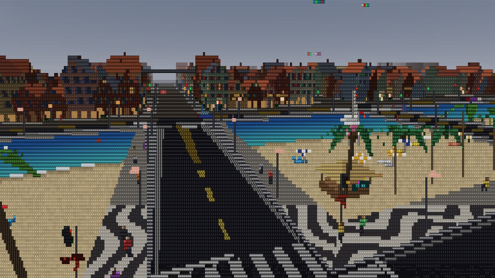 |
| 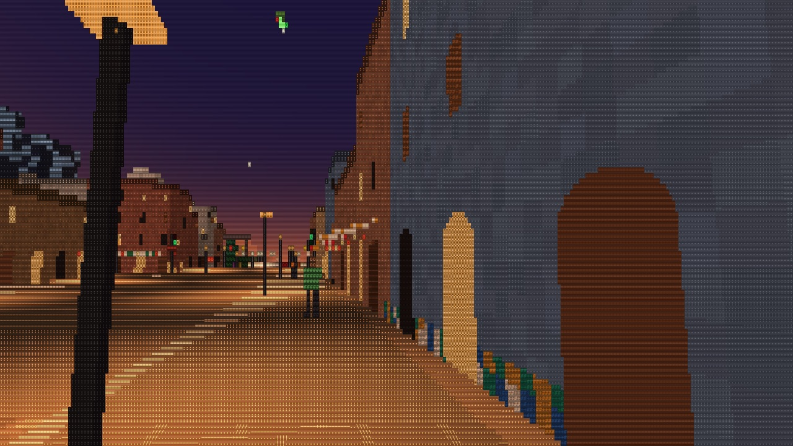 | 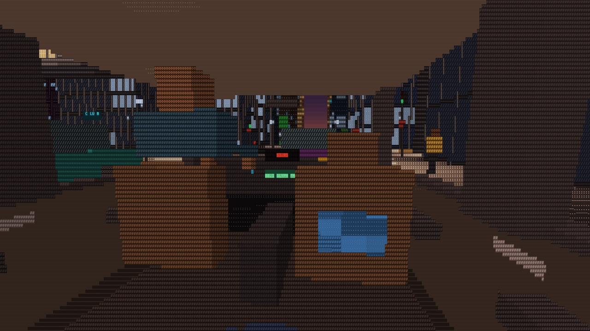 |
| 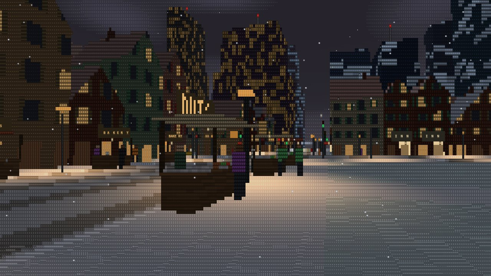 | 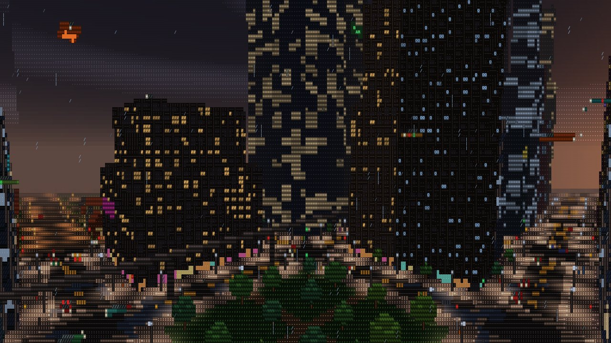 |
| 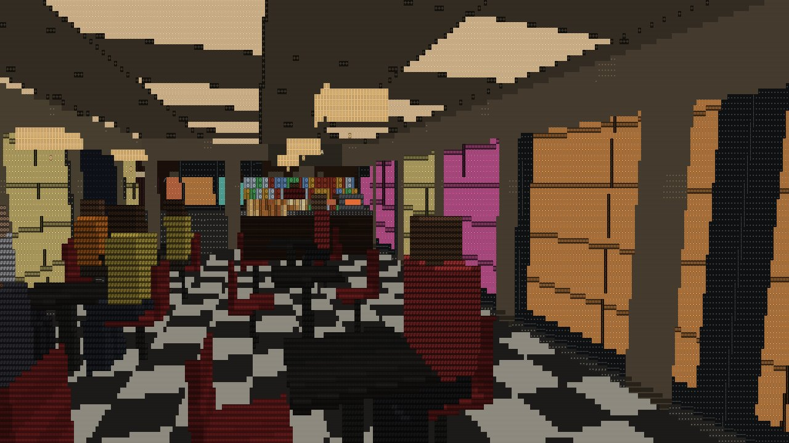 | 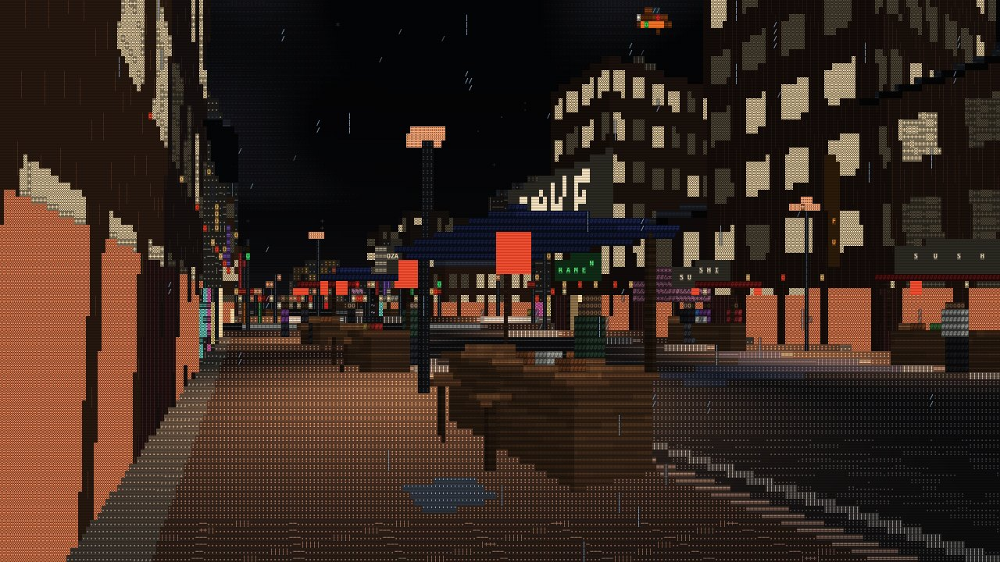 |
| 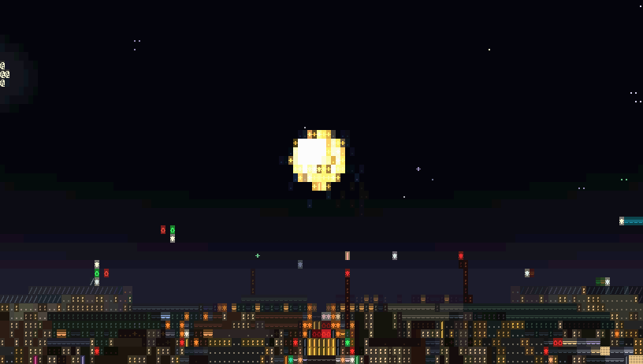 | 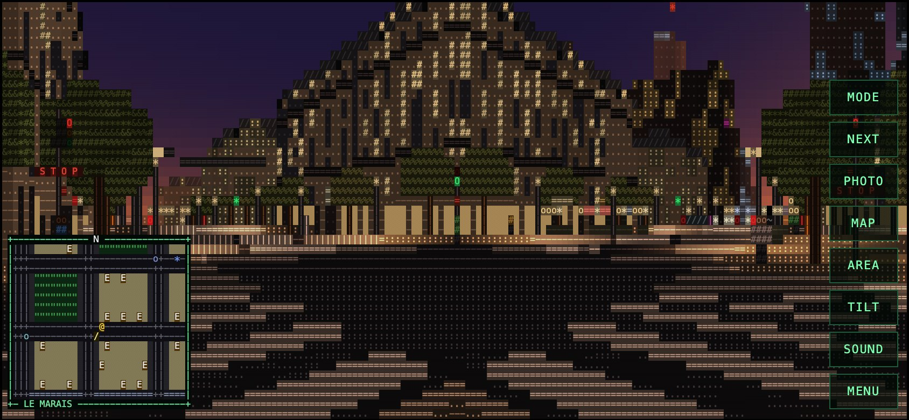 |

## Controls

| Keyboard | Action |
|---|---|
| Click, then mouse | Look around (Esc frees the mouse) |
| `W` `A` `S` `D` / arrows, `Shift` | Move, run |
| `Enter` | Hail a taxi and get in the back; again to pay and get out. On a station platform: board the train, and again to get off |
| `V` or `1`-`6` | Camera: walk, fly, street cameras, taxi, sky taxi, monorail |
| `N` | Next camera or vehicle |
| `E` / `Q` | Lift up / down, fly up / down, or change radio station in a cab |
| `B` / `M` | Next district / map (mini, full, off; click the full map to jump) |
| `K` | Straight to the Glyph Tower's observation deck (the District list also has it, the open roof and the tower's entrance) |
| `P` | Photo mode: `Enter` PNG, `G` GIF, `C` copy as text |
| `L` | Copy a link to this exact view |
| `R` / `Y` | Weather / time of day |
| `U` / `I` | Sound on or off / stats for nerds |
| `G` / `T` / `F` | Colour style / scanlines / full screen |
| `[` `]` | Bigger or smaller character cells |
| `O` / `H` | Auto tour (also starts after 45 s idle) / settings panel |
| `Z` | Emotes, when playing online |

On a phone the left half of the screen is a joystick (push further to run) and the right half drags the view. The
buttons on the right switch camera, take photos, open the map and the settings, and extra buttons appear when they are
useful: a taxi on the street (and get out when riding), rise and sink when flying, the lift, the radio, and the photo
actions.

The settings panel lets you pick the district, time of day, weather, how often fireworks and neon glitches happen and
the volume; folding sections hold the radio station and each kind of sound, the display options, and the key list.
Everything is remembered, including where you were and which sections were open. Keys that only apply in some places
(the lift, a taxi, the map, flying) are shown at the bottom of the screen while they apply.

### Links that open a specific view

| Parameter | Example | |
|---|---|---|
| `hood` | `?hood=japantown` | Start in a district (`downtown`, `japantown`, `oldtown`, `lemarais`, `docklands`, `mapleheights`, `silverhills`, `seafront`, `medina`) |
| `time` | `?time=night` | `cycle`, `dusk`, `night`, `dawn`, `day` |
| `weather` | `?weather=snow` | `clear`, `rain`, `snow`, `fog` |
| `tour` | `?tour=1` | Start the auto tour right away |
| `seed` | `?seed=42` | A different city |
| `cam`, `mode`, `floor`, `hour` | | Written by the share link |

## Playing together

When the online server is switched on, you see the other players near you: figures in bright shirts with a name tag,
or their cab when they ride. There is no chat. Everyone gets a generated name (`COSMIC GECKO`) and a fixed set of
emotes, from "hello" and "follow me" to a dance and a meow, so there is nothing to moderate. A shared link drops a
friend right next to you. The panel shows how many players are online in the whole city and in each district, so you
can head where the people are. It can be switched off in the panel, and [docs/ONLINE.md](docs/ONLINE.md) explains how it
works and scales.

## Privacy

No cookies and no accounts. Settings, found cats and where you were are kept in your browser. If usage counting is
on, [GoatCounter](https://www.goatcounter.com) counts visits and a few events (a district visited, a taxi ride) without
cookies or personal data, and not at all when the browser sends Do Not Track. Playing online shares only where you are
in the city and your emotes with players nearby; the server keeps nothing.

## How it works

- **Rendering** (`src/render/`): a scanline rasterizer fills a frame buffer with one glyph, foreground, background and
  depth per cell. Materials pick characters by how many cells a surface covers, so walls gain window frames and signs
  switch from a glowing bar to real letters to a block font as you get closer. A WebGL2 presenter draws the grid through
  a glyph atlas in a single pass (with a Canvas2D fallback).
- **World** (`src/world/`): the city is infinite and procedural. Each block is a pure function of its coordinates and
  the world seed, generated when it comes into view and forgotten when it is far away, so the same street always looks
  the same and nothing needs to be stored. Traffic, pedestrians, signals, interiors, cats, market stalls and fireworks
  are layered on top.
- **Sound** (`src/audio/`): everything is synthesized with the Web Audio API from oscillators and noise, including the
  radio stations, which are composed a fraction of a second ahead of the audio clock.
- **Quality** (`src/ui/quality.ts`): cell size, draw distance and pixel density adjust themselves to hold the target
  frame rate, so it stays smooth on slower phones. The "ludicrous" draw distance (1500 m) is the exception: it is left
  as set, at your own risk.
- **Offline**: the build generates a service worker that precaches every file.
- **Online** (`src/net/`, `server/`): a Cloudflare Worker with one Durable Object per 1 km zone of the city relays
  positions in a compact binary format; the city itself is never sent, since every player generates the same one.

## Run it locally

```sh
npm install
npm run dev          # http://localhost:5173
npm test             # unit tests (Vitest)
npm run test:e2e     # browser tests against the production build (Playwright)
npm run build        # type check and build into dist/
```

The first `npm run test:e2e` may ask for `npx playwright install chromium`.

Deployment to GitHub Pages is described in [docs/DEPLOYMENT.md](docs/DEPLOYMENT.md), and notes for coding agents are
in [AGENTS.md](AGENTS.md).
